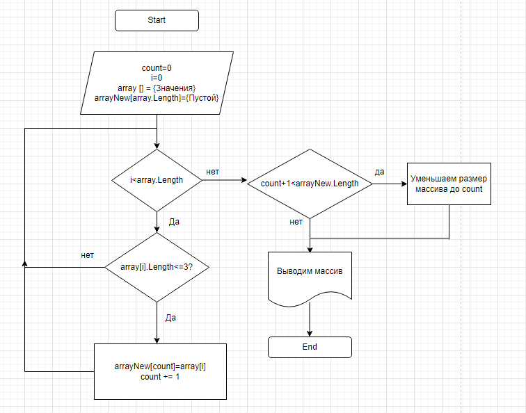

## Итоговая проверочная работа.
## **Условия задачи**

Задача алгоритмически не самая сложная, однако для полноценного выполнения проверочной работы необходимо:

1. Создать репозиторий на GitHub
2. Нарисовать блок-схему алгоритма (можно обойтись блок-схемой основной содержательной части, если вы выделяете её в отдельный метод)
3. Снабдить репозиторий оформленным текстовым описанием решения (файл README.md)
4. Написать программу, решающую поставленную задачу
5. Использовать контроль версий в работе над этим небольшим проектом (не должно быть так, что всё залито одним коммитом, как минимум этапы 2, 3, и 4 должны быть расположены в разных коммитах)

**Задача**: Написать программу, которая из имеющегося массива строк формирует новый массив из строк, длина которых меньше, либо равна 3 символам. Первоначальный массив можно ввести с клавиатуры, либо задать на старте выполнения алгоритма. При решении не рекомендуется пользоваться коллекциями, лучше обойтись исключительно массивами.

**Примеры**:
```
[“Hello”, “2”, “world”, “:-)”] → [“2”, “:-)”]
[“1234”, “1567”, “-2”, “computer science”] → [“-2”]
[“Russia”, “Denmark”, “Kazan”] → []
```
***

## **Решение**

1. Вы находитесь в созданном репозитории `FINAL HOMEWORK 1`.
2. Блок-схема алгоритма:

3. Вы читаете данный фаил `README.md`
4. Программа находится ниже:
Код программы
  string[] sourceArray =  { "Hello", "2", "World", ":-)" };
string[] newArray = FormingNewArray(size:DeterminingSizeNewArray(sourceArray),array:sourceArray);
PrintArray(array:sourceArray);
PrintArray(array:newArray);

int DeterminingSizeNewArray(string[]array)
{
    int length = 0;
    for (int i = 0; i < array.Length; i++)
    if (array[i].Length <= 3) 
    length++;
    return length;
}
string[] FormingNewArray(int size, string[] array)
{
    int position = 0;
    string[] threeArr = new string[size];
    for (int i = 0; i < array.Length; i++)
    {
        if (array[i].Length <= 3)
        {
            threeArr[position] = array[i];
            position++;
        }
    }
return threeArr;
}
void PrintArray(string[] array)
{
    Console.Write("[");
    Console.Write(string.Join(",",array));
    Console.Write("]");
    Console.WriteLine(); 
}

  


